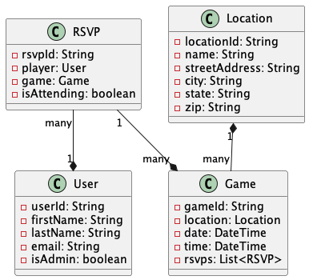

# Pickup Soccer Game Management App

## Why?
In June 2023 I decided to upskill myself by going through the
[Bloomtech Backend Engineering course.](https://www.bloomtech.com/courses/backend-development)
The course material was **developed by Amazon** for their 
[Amazon Technical Academy](https://amazontechnicalacademy.com/) program that takes employees in
non-tech roles and prepare them to be software engineers at Amazon. This projects serves to demonstrate the application of skills and technologies 
I've learned while in the program.

To see a live instance of the app, feel free to create your own user here: [Pittman Park Pickup Soccer App](http://renes-pittman-park-app-bucket.s3-website-us-east-1.amazonaws.com/)

# What is it?
I'm an avid soccer player and play in a weekly pickup game every Saturday morning at a local park. Because it's a pickup
game, players can choose to attend or not up until the last minute. This presents a few different challenges. For example,
during the winter when the mornings could be very cold, it's possible that you might not have enough players to make a
game happen. However, you might not know if that is the case until you drive out to the fields only to find out there
aren't enough players for a game. Conversely, during the warmer months, you could have too many players for just one game.
In these cases, it would be good to know in advance to help with field setup and equitably splitting up the game into multiple
games.

This app is an attempt to allow admins to be able to schedule games and allow players to RSVP for a given game so
admins can plan accordingly. Whether that's letting people know the game is cancelled if there aren't enough players or
helping admins plan out how many fields to set up and which players get assigned to which game.

There are two overarching personas that would use this app:

* Game Admins
* Players

# Technologies Used
### Backend
Java, Amazon DynamoDB
### Frontend
JavaScript, React, ReactRouter, Bootstrap
### Deployment
AWS, AWS Lambda, Amazon API Gateway, Amazon DynamoDB, Amazon S3

# How did I go about it?
First step was thinking about what I wanted to build for a midpoint project. I'm passionate about soccer and decided this
would be a good problem to try to tackle. I put together an initial [design document](./project_documents/design_document.md)
complete with user stories, scope, proposed tech, etc.

From there, I created an initial UML diagram for the model relationships and then got to work. Once the app was in a good spot, I
created my own `npm run` commands to deploy the backend and the frontend.

*Models relationship diagram*

# Reflection

There are plenty of things to improve on here. Overall, given that this project was done halfway through Bloomtech program,
I received positive feedback on the complexity of the project to that point. On my roadmap in terms of improvements are:

* Adding authentication/authorization
* Improved frontend design (I'm not a designer, so going to see if I can get help with that one!)
* Address Lambda cold-start problem in the app
* Update to use SSL